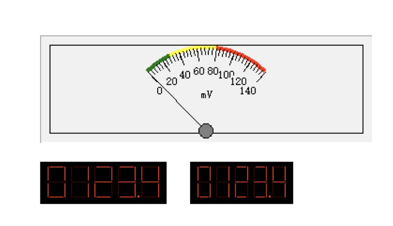

# “CanTool”项目需求文档

## 1. 前言

### 1. 1编写目的

​	本文描述cantoolapp的业务需求，作为后续系统开发的基础，并为项目的测评与验收提供依据，供开发人员使用。

## 2. 业务概述

​	在现代汽车控制技术中，汽车中会使用多个电子控制装置（ECU：Electronic Control Unit）对整车进行控制。而ECU之间的信息交换更多地依赖CAN(Controller Area Network)总线的网络连接方式来完成。为了检测和控制CAN bus的信息内容，需要使用CAN bus检测设备。CanTool装置是完成CANbus检测的工具。为了实现CAN数据的显示及控制，需要使用本文提出的CanToolApp软件。该软件需要将连接在CAN总线上的CanTool装置采集的CAN信息发送到上位机（移动终端Android、iOS、Windows PC），并由运行在上位机中的CanToolApp软件接收这些信息，显示在用户图形界面上。同时在CanToolApp的界面上还可以设定CAN信息，通过GUI按钮将信息发送给CanTool装置，CanTool装置将按照规定的信息格式，将信息发送的CAN总线上。

## 3功能需求分析

#### 3.1COM口设置

​	能够搜索到本机所有可使用的COM口，并在弹出式ComboBox中以列表方式让用户选择CanTool装置在上位机中映射的COM口。并设置相应COM口波特率115200、数据位数8、停止位数1。这些设定内容可保存到CanToolApp设定文件中，供下次使用。

#### 3.2速率设置

​	修改总线的通信速率（可选10、20、50、100、125、250、500、800、1024Kbit）
####3.3数据显示

​	对收到的CAN信息进行解析并显示，显示时可以让用户选择仪表盘方式显示CAN信号的物理值，并将用户选择的显示方式保存在配置文件中，仪表盘如图所示

​	用户还可以选择某些接收到的CAN信号，显示变化曲线

####3.4数据保存

​	将接受到的所有CAN信息数据保存为数据文件，格式为CSV或自定义
####3.5消息发送

​	用户指定发送CAN信息，并且可以指定发送周期，APP把用户设定的物理值转化为CAN信号值，将CAN信息中包含的所有CAN信号合成完整的CAN信息后，发送给CanTool装置

####3.6可视化清晰
​	用户通过cantoolapp实现的操作要尽可能的以图形化的简洁形式展现

###4运行环境
####4.1硬件环境
各类android手机
####4.2软件环境
android5.0及以上版本
####4.3开发环境
开发语言：java
开发工具：AndroidStudio
